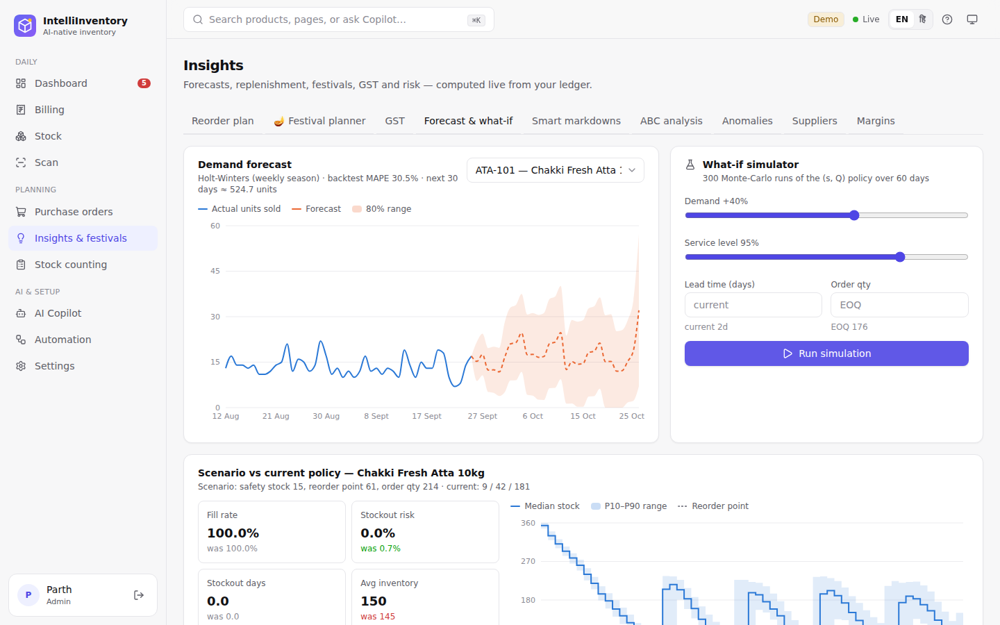
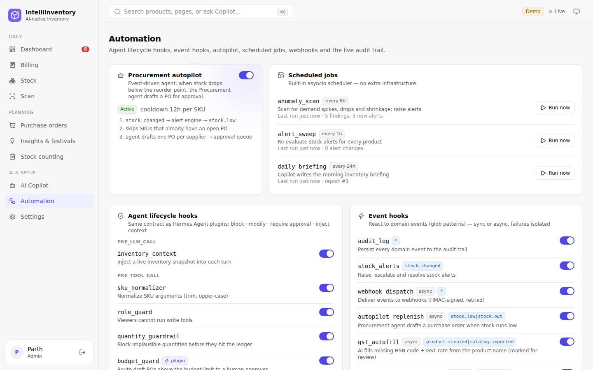
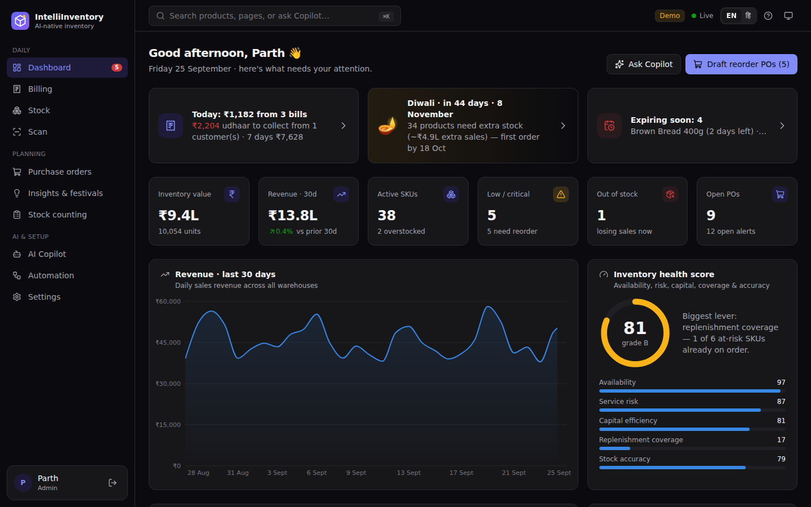
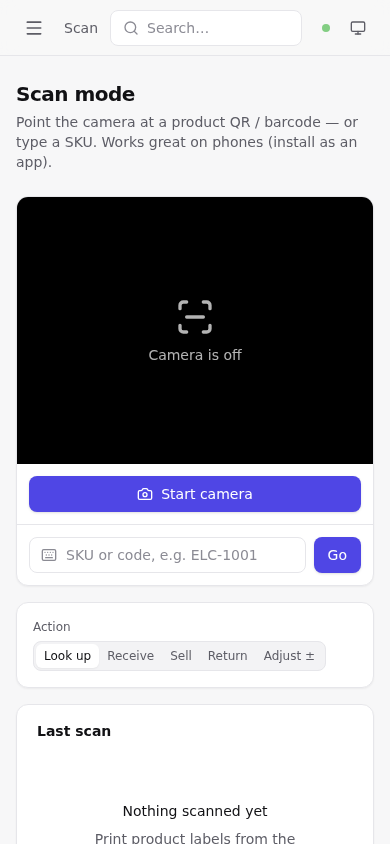
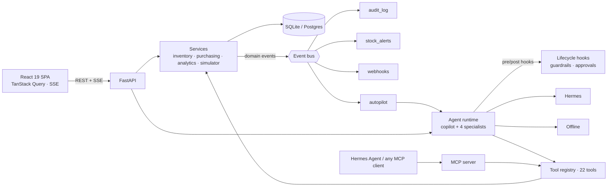

# IntelliInventory

**AI-native inventory management that plans itself, and asks before it acts.**

It forecasts demand, computes reorder points, drafts purchase orders and investigates anomalies with a team of AI agents. You can run them on **Hermes** (Nous Research, free and local via Ollama) or a built-in **offline planner** that needs no model at all — no paid API anywhere. Every agent action passes through lifecycle **hooks**, and anything that changes stock waits for a human to approve it.

> **100% free to run.** SQLite plus an open-source stack. The default AI mode needs no API key, and real LLM reasoning is also free with a local Hermes model.


| AI Copilot (multi-agent, approvals) | Forecast & what-if simulator |
|---|---|
|  |  |
| **Product drawer (forecast band, policy)** | **Automation (hooks, autopilot, webhooks)** |
|  |  |
| **Dark mode** | **Mobile scan mode (PWA)** |
|  |  |

---

## Features

### Inventory core
- Products, categories, suppliers and **multiple warehouses**, with stock tracked per warehouse.
- An append-only **movement ledger**: receipts, sales, adjustments, transfers and returns, each recording who or which agent did it.
- **Purchase-order lifecycle**: draft → approved → ordered → received, where receiving posts stock. Purchase orders are printable.
- **Cycle counts** with a blind-count mode. Variances are posted as audited adjustments.
- **Barcode/QR scan mode** for phones: camera scanning with ZXing, printable QR labels, and installable as a PWA.
- CSV **import with a dry-run preview**, plus CSV export of inventory and movements.
- **RBAC** with JWT auth and four roles: viewer, staff, manager and admin.

### Intelligence (deterministic, works offline)

| Feature | How |
|---|---|
| Demand forecast | Holt-Winters with weekly seasonality, an 80% band and backtest MAPE |
| Replenishment policy | Safety stock = z·σ·√L, reorder point, and EOQ rounded to the supplier's MOQ |
| **What-if simulator** | Monte-Carlo (300 runs) of the (s, Q) policy under changed demand, lead time, service level or order quantity |
| **Inventory health score** | A single 0–100 score that explains itself: availability, service risk, capital efficiency, replenishment coverage and accuracy |
| **Stockout radar** | When each item runs out, compared with supplier lead time. It shows whether an order placed today still arrives too late. |
| **Smart markdown advisor** | Discounts that clear excess stock in about 60 days and never price below cost + 5% |
| Anomaly detection | Demand spikes (z-score), demand collapse, and shrinkage or write-offs |
| ABC analysis, supplier scorecards, margins | Pareto classes; on-time rate and actual vs promised lead time; gross margin by category |

### Multi-agent AI
- **Copilot** is the orchestrator. It delegates to four specialists: **Analyst**, **Forecaster**, **Procurement** and **Auditor**. Specialists stream their work inline as nested cards.
- The agents share **22 typed tools** (plus any a plugin adds): one registry that also backs the MCP server.
- **Human in the loop:** stock adjustments, transfers, PO status changes and reorder-setting changes become approval requests. They run only when a manager clicks *Approve & run*.
- The **procurement autopilot** is an event-driven agent. When stock drops below the reorder point, it drafts a PO for approval, with a per-SKU cooldown and deduplication against open POs.
- A **daily AI briefing** is written by the Copilot on a schedule, and can be read aloud.
- **Voice**: speak to the Copilot and hear its answers. This uses the browser's built-in Web Speech API, so it is free.
- **Hinglish** is understood even by the free offline planner, e.g. *"kya order karna hai?"* or *"kaunsa stock kam hai?"*.
- **Traces**: a timeline of every run, covering LLM steps, hook decisions, tools, durations and tokens.

### Hooks everywhere
| Layer | Hooks |
|---|---|
| **Agent lifecycle** (same contract as Hermes Agent plugins) | `pre_llm_call` (inject context) · `pre_tool_call` (block / modify / require approval) · `post_tool_call` · `post_llm_call` · `agent:start/step/end` |
| Built-in agent hooks | `sku_normalizer`, `role_guard`, `quantity_guardrail`, `approval_gate`, `tool_audit`, `inventory_context`, `run_reporter` |
| **Event hooks** (glob patterns) | `audit_log`, `stock_alerts`, `webhook_dispatch`, `autopilot_replenish` |
| **Webhooks** | HMAC-SHA256 signed, 3 retries, delivery log; Slack and Discord URLs are auto-formatted |
| **Plugins** | Drop a `register(ctx)` module into `backend/app/plugins/` to add agent hooks, event hooks and tools. See the `budget_guard` example. |
| **Hermes Agent** | Plugin (`pre_tool_call` guardrail, `post_tool_call` audit), gateway hook and skill in `integrations/hermes/` |
| **Claude Code** | `SessionStart` installs dependencies; `PostToolUse` formats edited files (`.claude/settings.json`) |

Every hook can be toggled live from the **Automation** page.

### UX
The UI has:
- a ⌘K command palette and `g` + key navigation shortcuts
- live updates over SSE, with toasts for alerts, approvals and agent actions
- light and dark themes
- responsive layout and PWA install
- accessible charts (validated colour-blind-safe palette, legends and tooltips)

---

## Quick start

Prerequisites: **Python 3.11+ with [uv](https://docs.astral.sh/uv/)** and **Node 20+**.

```bash
make install     # uv sync + npm install
make dev         # API on :8000 + web on :5173
```

Open http://localhost:5173 and sign in as **parth@intelliinventory.dev** (owner/admin) or **ananya@intelliinventory.dev** (manager) with password **demo1234**. Demo data (37 products, 120 days of history) is seeded on first start.

**Single container:**

```bash
docker compose up --build                     # http://localhost:8000
docker compose --profile hermes up --build    # + Ollama, then: docker compose exec ollama ollama pull hermes3
docker compose --profile postgres up --build  # + PostgreSQL 17 (set DATABASE_URL)
```

Production build without Docker: `make build`, then `make api`. FastAPI serves the SPA from `frontend/dist`.

---

## AI providers: free first

`AI_PROVIDER=auto` (the default) picks the first available provider:

1. **Hermes**, if you configured an endpoint *or* a local Ollama is serving a Hermes model. Hermes is auto-detected and needs no key.
2. **Offline planner** otherwise. It is deterministic, instant and free, and understands Hinglish ("Diwali ke liye kya stock karna hai?").

You can switch providers per chat in the Copilot header, or globally in **Settings → AI providers**.

| Provider | Setup | Cost |
|---|---|---|
| Offline planner | nothing | free |
| **Hermes via Ollama** | `ollama pull hermes3:3b` (8 GB laptop) or `hermes3` (16 GB) and keep Ollama running | **free, local, private** |
| Hermes via vLLM / LM Studio / llama.cpp (self-hosted) | `HERMES_BASE_URL`, `HERMES_MODEL` | free |

The Hermes provider supports native OpenAI-style tool calling. It also supports Hermes' own `<tool_call>` XML format (`HERMES_TOOL_MODE=prompt`) for servers without tool support. Hermes 4 `<think>` reasoning is streamed separately, so it never leaks into answers.

---

## Hermes Agent and MCP

The same tools, guardrails and approvals are exposed over the **Model Context Protocol**:

```bash
make mcp                                   # stdio
# or HTTP: http://localhost:8000/mcp/  with  Authorization: Bearer $INTEGRATION_TOKEN
```

**Hermes Agent** (Nous Research): run `./integrations/hermes/install.sh`, then add this to `~/.hermes/config.yaml`:

```yaml
mcp_servers:
  intelliinventory:
    command: "uv"
    args: ["run", "--directory", "/path/to/IntelliInventory/backend", "python", "-m", "app.mcp_server"]
```

The tools then appear as `mcp_intelliinventory_*`. With the Hermes gateway you can ask about your inventory from Telegram, Discord, Slack or WhatsApp. The pack also installs a guardrail plugin, a gateway audit hook and a skill with operating playbooks.

**Claude Code:** the repo ships a `.mcp.json`, so the tools are available as soon as you open the project. For another project, run `claude mcp add intelliinventory -- uv run --directory backend python -m app.mcp_server`.

---

## Architecture



```
backend/app
  agents/      toolkit.py (typed tool registry) · tools.py · hooks.py · registry.py · runtime.py · providers/
  hooks/       bus.py (event bus) · builtin.py · webhooks.py
  services/    inventory · purchasing · analytics · simulator · suppliers · counts · importer · scheduler
  api/         auth · catalog · operations · insights · agents · automation
  plugins/     drop-in plugins (budget_guard example)
  mcp_server.py · seed.py · models.py · security.py · main.py
frontend/src
  pages/ · components/ (ui kit, charts, copilot) · hooks/ (useAgentChat, useLiveEvents, queries…) · lib/
integrations/hermes   Hermes Agent plugin, gateway hook, skill, installer
```

## Development

```bash
make test    # pytest (analytics, lifecycle, hooks, agents, Hermes provider over mocked HTTP, India/GST, API, MCP, autopilot e2e) + vitest
make lint    # ruff + oxlint + tsc
make migrate # Alembic migrations (backend/migrations) for Postgres / production
```

Configuration lives in [`.env.example`](.env.example). Every value is optional.

## Tech stack
**Backend:**
- Python 3.11, FastAPI, SQLModel / SQLAlchemy 2, Pydantic v2
- uv, Ruff, pytest, Alembic
- PyJWT + Argon2
- sse-starlette, the MCP Python SDK v2
- the `openai` SDK (for Hermes / Ollama endpoints)

**Frontend:**
- React 19, Vite 8, TypeScript 6, Tailwind CSS v4
- Radix UI, TanStack Query, React Router
- Recharts, cmdk, sonner, react-markdown, ZXing
- vite-plugin-pwa, Vitest, oxlint

**Ops:**
- Docker (multi-stage) and docker-compose, with optional Ollama and Postgres
- GitHub Actions CI
- Claude Code hooks

## License
MIT
