# IntelliInventory — Poora Tutorial (Hinglish)

Yeh guide aapko **zero se** sab kuch sikhayegi: computer pe kaise chalana hai, roz ka kaam (billing, stock, khata),
AI Copilot, GST, festival planning, aur **free mein online kaise daalna hai** (ek demo link + ek asli dukaan ka link).

> Sab kuch **free** hai. Koi paid API nahi. AI (Hermes) aapke apne computer / free server pe chalta hai.

---

## Index

1. [Yeh app kya karta hai?](#1-yeh-app-kya-karta-hai)
2. [Computer pe chalana (Windows / Mac / Linux)](#2-computer-pe-chalana)
3. [Pehla login — Demo vs Asli dukaan](#3-pehla-login--demo-vs-asli-dukaan)
4. [Sabse pehle: Shop details bharo](#4-sabse-pehle-shop-details-bharo)
5. [Billing — bill kaise banaye (3 steps)](#5-billing--bill-kaise-banaye-3-steps)
6. [Khata (udhaar) — kisko kitna dena hai](#6-khata-udhaar)
7. [Stock — products, GST, scan](#7-stock--products-gst-scan)
8. [Purchase orders — supplier se maal mangwana](#8-purchase-orders)
9. [Insights & festivals — Diwali ki taiyari](#9-insights--festivals)
10. [GST — optional, AI se bharo, rate badle toh?](#10-gst)
11. [AI Copilot — Hindi/Hinglish mein poocho](#11-ai-copilot)
12. [Hermes AI free mein kaise chalaye](#12-hermes-ai-free-mein)
13. [Users & roles](#13-users--roles)
14. [Automation, hooks, webhooks (advanced)](#14-automation-hooks-webhooks)
15. [Free mein online daalo — 2 links (demo + asli)](#15-free-deploy--2-links)
16. [Payment gateway ka sawaal](#16-payment-gateway-ka-sawaal)
17. [Problem aaye toh (Troubleshooting)](#17-troubleshooting)

---

## 1. Yeh app kya karta hai?

| Kaam | Kahan |
|---|---|
| Bill banana (GST ya bina GST), UPI QR, WhatsApp pe bill bhejna, print | **Billing** |
| Udhaar ka hisaab, WhatsApp reminder | **Billing → Khata** |
| Kitna maal hai, kab khatam hoga, kab mangwana hai | **Stock** |
| Supplier ko order (PO) bhejna, GST + e-way bill | **Purchase orders** |
| Diwali / Holi / Eid ke liye kya stock karna hai | **Insights & festivals** |
| GST kitna banega (output tax vs ITC) | **Insights → GST** |
| "aaj ki sale kitni hui?" jaise sawaal | **AI Copilot** |

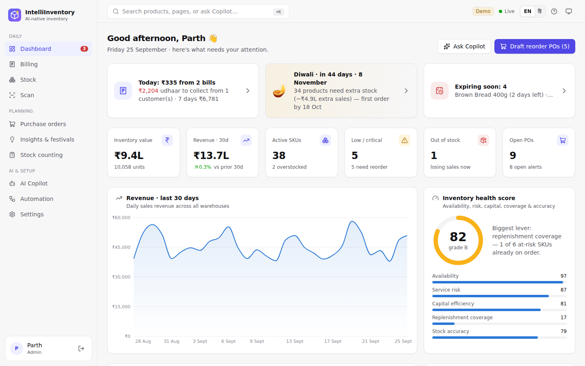

---

## 2. Computer pe chalana

### Ek baar install karo (sirf pehli baar)

1. **Git** — https://git-scm.com/downloads
2. **Node.js (LTS)** — https://nodejs.org
3. **uv** (Python ka tool, Python khud install kar leta hai):
   - **Windows (PowerShell):**
     ```powershell
     powershell -ExecutionPolicy ByPass -c "irm https://astral.sh/uv/install.ps1 | iex"
     ```
     Phir **PowerShell / cmd band karke dobara kholo** (warna `'uv' is not recognized` aayega).
   - **Mac / Linux:**
     ```bash
     curl -LsSf https://astral.sh/uv/install.sh | sh
     ```

### Code download karo

```bash
git clone https://github.com/parthkansal823/IntelliInventory.git
cd IntelliInventory
```

### Chalao — sabse aasaan tarika (one-click)

- **Windows:** `scripts\start-windows.bat` pe **double-click** karo.
- **Mac / Linux:** `./scripts/start.sh`

Pehli baar 2–5 minute lagenge (sab install hota hai). Phir browser mein khud khulega: **http://localhost:8000**

### Developer tarika (code badalna ho toh — auto reload)

Do terminal kholo:

```bash
# Terminal 1 — backend (API) :8000
cd backend
uv run uvicorn app.main:app --reload

# Terminal 2 — frontend (UI) :5173
cd frontend
npm install
npm run dev
```

Browser: **http://localhost:5173**. (Mac/Linux pe `make install` aur `make dev` bhi chalega.)

### Docker se (optional)

```bash
docker compose up --build                     # http://localhost:8000
docker compose --profile hermes up --build    # + Hermes AI (Ollama)
docker compose exec ollama ollama pull hermes3:3b   # pehli baar model download
```

---

## 3. Pehla login — Demo vs Asli dukaan

App do tarah chalta hai:

| Mode | Kab | Kya hota hai |
|---|---|---|
| **Demo** (`DEMO_MODE=true`, default) | Dikhane / seekhne ke liye | 37 sample products, 120 din ki sale, bills, udhaar — sab bhara hua. Login page pe demo accounts dikhte hain. |
| **Asli dukaan** (`DEMO_MODE=false`) | Apne business ke liye | Khaali catalogue, sirf ek **admin** account (aapka). Koi sample data nahi. |

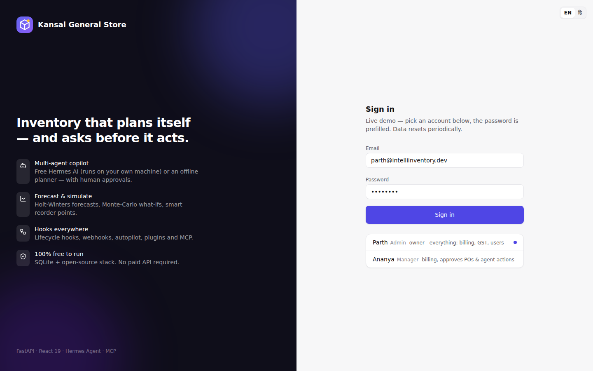

**Demo logins** (password `demo1234`):
- **Parth** — `parth@intelliinventory.dev` — Owner / Admin (sab kuch)
- **Ananya** — `ananya@intelliinventory.dev` — Manager (billing, approvals)

**Asli dukaan ke liye** `backend/.env` file banao (`.env.example` copy karke):

```ini
DEMO_MODE=false
ADMIN_EMAIL=aap@aapkidukaan.in
ADMIN_NAME=Aapka Naam
ADMIN_PASSWORD=koi-strong-password
SECRET_KEY=koi-lambi-random-line-yahan-likho
```

Phir app chalao, isi email/password se login karo.

> Demo data dobara chahiye? App band karo, `backend/data/intelliinventory.db` delete karo, phir chalao.
> Password bhool gaye? `cd backend` → `uv run python -m app.cli reset-password aap@aapkidukaan.in naya-password`

---

## 4. Sabse pehle: Shop details bharo

**Settings → Business & GST → Shop details**

- Dukaan ka naam, address, phone
- **GSTIN** (agar hai) — state khud GSTIN se aa jaata hai
- **UPI ID** (jaise `aapkidukaan@okaxis`) — isse har bill pe **exact amount wala UPI QR** banta hai
- **Bill number prefix** — `INV` → bills `INV/26-27/00001` banenge (har financial year April–March nayi series)
- Footer / terms (jaise "Goods once sold will not be taken back")

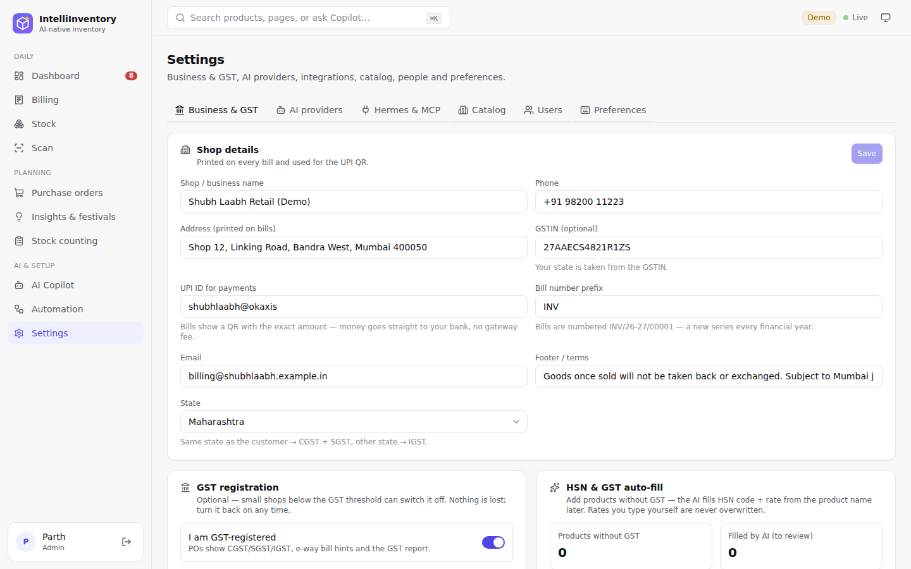

---

## 5. Billing — bill kaise banaye (3 steps)

Sidebar → **Billing** → **New bill**

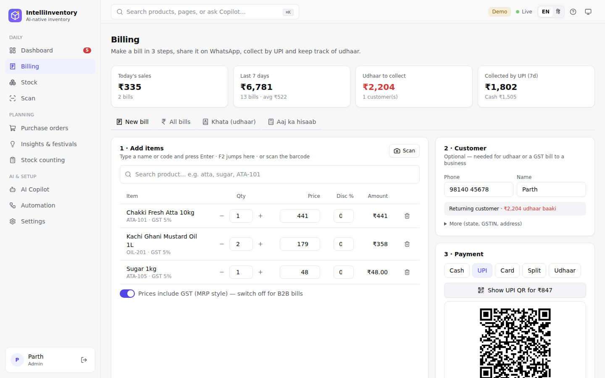

**Step 1 · Items daalo**
- Naam ya code likho (jaise `basmati`) → **Enter** dabao → item add.
- **Scan** button → phone/laptop camera se barcode scan.
- Qty `–`/`+`, price aur **Disc %** badal sakte ho. Stock kam hai toh laal mein warning.
- **Prices include GST** (MRP style) ON = counter sale; OFF = B2B bill (price + GST).
- Shortcut: **F2** = search box.

**Step 2 · Customer (optional)**
- Walk-in customer ke liye kuch mat bharo.
- Phone number daalo → purana customer hai toh naam khud aa jaata hai + **"₹X udhaar baaki"** dikhta hai.
- "More" mein: State (dusre state = IGST), **Outside India** (export — zero-rated), GSTIN (business customer).
- Phone number **+91 zaroori nahi** — `98200 12345` likho toh +91 lag jaata hai; bahar ka number `+971 50 123 4567` jaisa likho.

**Step 3 · Payment**
- **Cash** — "Cash received" likho → wapas kitna dena hai (change) dikhega.
- **UPI** — "Show UPI QR" → customer GPay/PhonePe/Paytm se scan kare → UTR (optional) likho.
- **Card**
- **Split** — thoda cash + thoda UPI; bacha hua khata mein.
- **Udhaar** — poora amount customer ke khata mein.

**Save bill** → bill khulta hai:

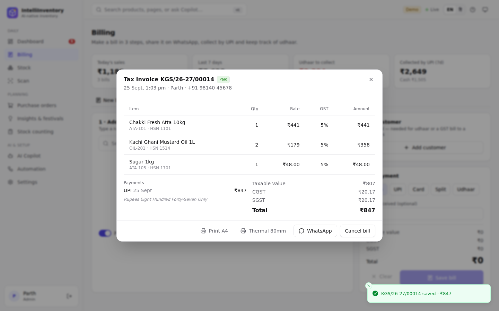

- **Print A4** (GST tax invoice, HSN summary, amount in words, UPI QR, signature)
- **Thermal 80mm** (chhota printer wala bill)

| A4 tax invoice | Thermal 80 mm |
|---|---|
| 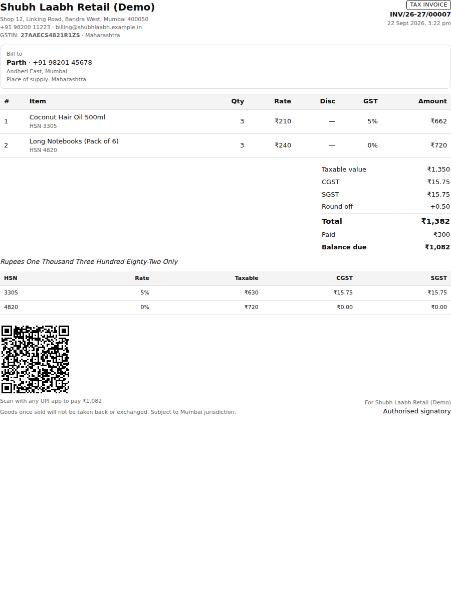 |  |

- **WhatsApp** — customer ko bill ka message (free, `wa.me` link)
- **Receive payment** — baaki paisa baad mein
- **Cancel bill** (manager) — stock wapas aa jaata hai

**All bills** tab: search, filter (udhaar/paid/cancelled), aur **Sales register (CSV for CA)** — GSTR-1 friendly file, CA ya Tally ke liye.

GST ke hisaab se bill khud sahi banta hai:

| Situation | Bill type | Tax |
|---|---|---|
| Customer same state / walk-in | Tax Invoice | CGST + SGST |
| Customer dusre state | Tax Invoice | IGST |
| Customer Outside India (export) | Export Invoice | 0 (LUT note) |
| GST OFF (registered nahi) | Bill of Supply | koi tax nahi |

---

## 6. Khata (udhaar)

**Billing → Khata (udhaar)**

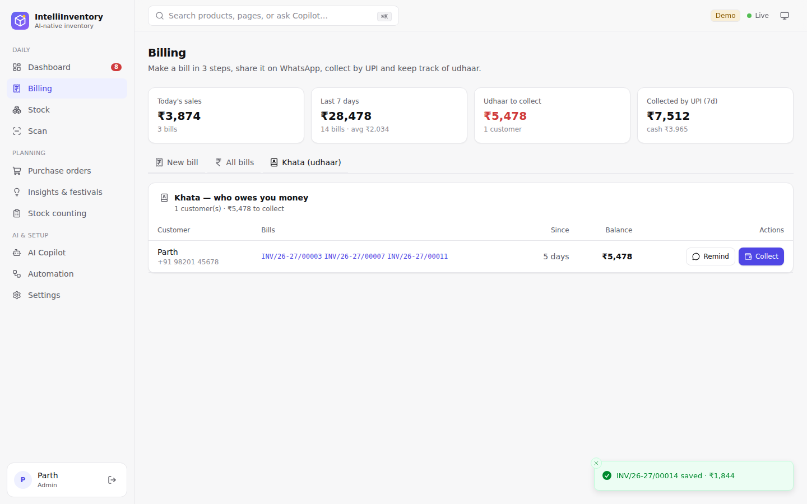

- Kis customer pe kitna baaki, kitne din se (30+ din laal).
- **Remind** → WhatsApp pe Hinglish reminder (UPI ID ke saath) — free.
- **Collect** → paisa aaya toh amount + mode likho → **sabse purana bill pehle** clear hota hai.

---

## 7. Stock — products, GST, scan

**Stock** page: har product ka stock, status (out / critical / low / healthy / overstock), kitne din chalega.

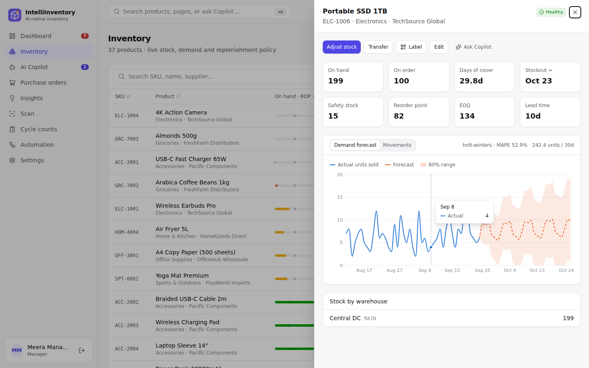

- Product pe click → forecast chart, warehouse-wise stock, movements, GST/HSN, margin.
- **Add product** — SKU, naam, cost, selling price. **GST optional**: khaali chhodo, AI naam se HSN + GST bhar dega; ya **Suggest with AI** dabao.
- **Fill GST with AI** — jin products ka GST khaali hai sab ek click mein. AI wale rates pe "AI (check)" likha aata hai — ek baar CA se confirm kar lo.
- **Import CSV** (preview ke baad import), **Export**.
- **Scan** page (sidebar): phone se barcode scan karke receive / sell / return / adjust. Phone pe "Install app" karke app jaisa use karo.
- **Stock counting**: physical count → difference → manager approve → stock theek.

---

## 8. Purchase orders

**Purchase orders** → **Generate from recommendations** (jo kam hai uske PO, supplier-wise).

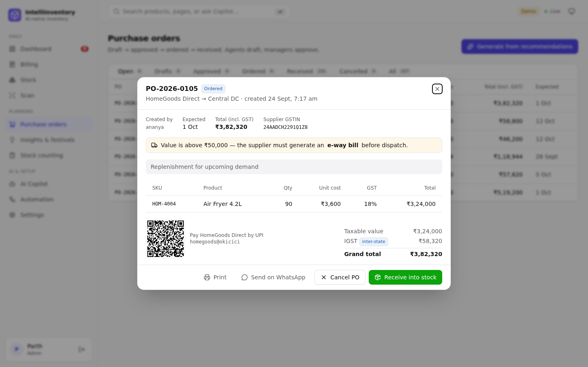

Flow: **Draft → Approved → Ordered → Received** (receive karte hi stock badhta hai).

- GST breakup: same state = CGST + SGST, dusra state = IGST.
- ₹50,000 se zyada ka maal → **e-way bill** warning.
- **Send on WhatsApp** → supplier ko PO ka message.
- Supplier ka UPI ID ho toh **UPI QR** se payment.

---

## 9. Insights & festivals

**Insights & festivals** page ke tabs:

| Tab | Kya milta hai |
|---|---|
| **Reorder plan** | Kya mangwana hai, kitna, kyun — ek click mein POs |
| **🪔 Festival planner** | Navratri, Diwali, Chhath, Holi, Eid, Rakhi, Ganesh Chaturthi, Onam… kitna extra maal, **kab tak order karna hai** (supplier lead time ke hisaab se) → **Draft festival POs** |
| **GST** | Output tax vs input tax credit, slab-wise |
| **Forecast & what-if** | "Demand 30% badhi toh?" — simulation |
| **Smart markdowns** | Zyada pada maal — kitna discount do |
| **ABC / Anomalies / Suppliers / Margins** | Analysis |

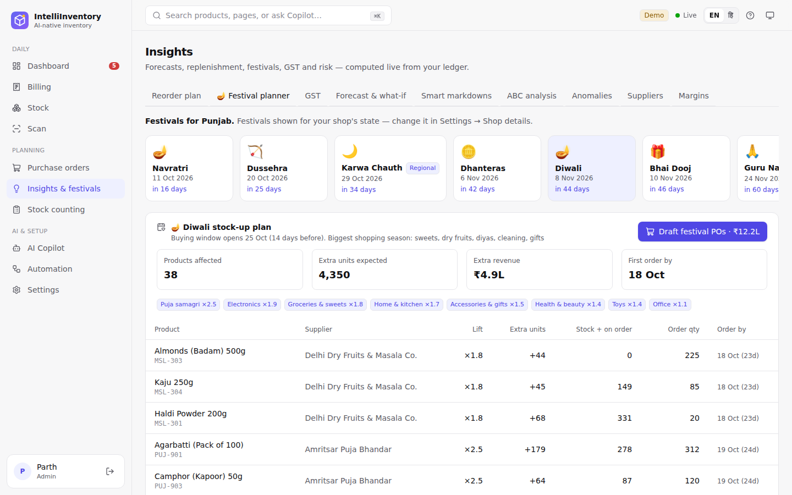

Dashboard pe bhi agla festival aur aaj ki billing dikhti hai.

---

## 10. GST

- **Optional hai.** Registered nahi ho? **Settings → Business & GST → "I am GST-registered" OFF**. Tab bills "Bill of Supply" banenge, POs bina tax.
- **GST 2.0** (22 Sep 2025 se) slabs: **0 / 5 / 18 / 40%** (+ gold 3%). 12% aur 28% hat gaye.
- **Rate badle toh?** Settings mein **GST slabs** edit karo (jaise `0, 5, 12, 18, 28`) → **Save**. AI suggestions naye slabs pe snap honge. **Re-check AI-filled rates** se AI wale rates dobara check honge. **Aapke haath se daale rates kabhi overwrite nahi hote.**
- GSTIN checksum validate hota hai (galat GSTIN reject).

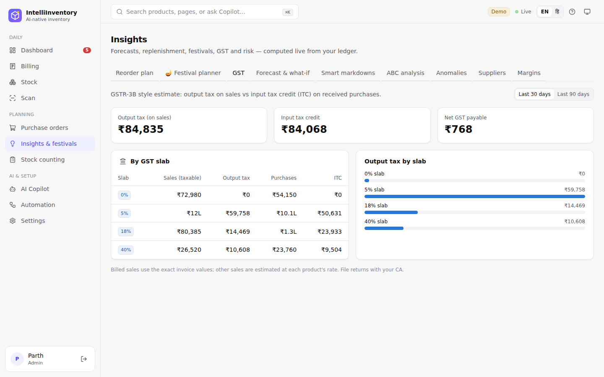

> GST rates illustrative hain — file karne se pehle apne CA se confirm karein.

---

## 11. AI Copilot

Sidebar → **AI Copilot**. Hindi / Hinglish / English — sab chalta hai:

- `aaj ki sale kitni hui?`
- `kiska udhaar baaki hai?`
- `Diwali ke liye kya stock karna hai?`
- `kaunsa stock kam hai aur kya order karna hai?`
- `is mahine GST kitna banega?`
- `show invoice INV/26-27/00003`
- `What if demand for ACC-2001 rises 30%?`

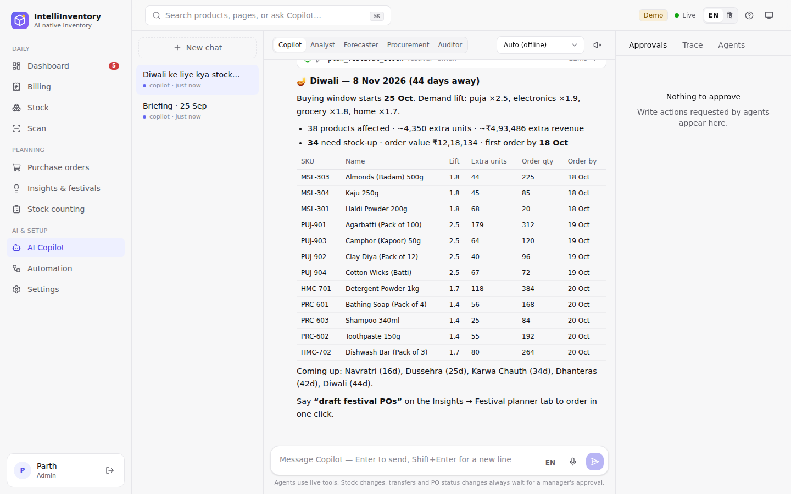

- **🎤 Mic** se bolo. **EN / हिं** button se Hindi voice (bolna + sunna).
- Copilot ke saath 4 specialists: Analyst, Forecaster, Procurement, Auditor.
- **Safety:** stock badalna, transfer, PO status — AI khud nahi karta, **approval** maangta hai (Approvals panel → Approve & run).
- **Ctrl+K** (Mac: ⌘K) — kahin se bhi search / quick sawaal.

---

## 12. Hermes AI free mein

Bina kisi setup ke bhi Copilot chalta hai (**offline planner** — fast, free, Hinglish samajhta hai).
Asli AI (Hermes, Nous Research) chahiye toh — **free, aapke computer pe:**

1. **Ollama** install karo — https://ollama.com/download
2. Model download:
   ```bash
   ollama pull hermes3:3b     # ~2 GB — 8 GB RAM laptop pe chalega
   # ya
   ollama pull hermes3        # ~4.7 GB — 16 GB RAM, zyada smart
   ```
3. `backend/.env` mein: `HERMES_MODEL=hermes3:3b` (jo model liya)
4. App restart. **Settings → AI providers** mein "Hermes" = ready dikhega. Auto mode khud Hermes use karega.

---

## 13. Users & roles

**Settings → Users** (admin): naye log add karo.

| Role | Kya kar sakta hai |
|---|---|
| viewer | sirf dekhna |
| staff | billing, scan, counting, PO draft |
| manager | + approvals, bill cancel, GST settings, CSV export |
| admin | sab kuch + users |

---

## 14. Automation, hooks, webhooks

**Automation** page (advanced — zaroorat ho tabhi):
- **Autopilot**: stock kam hote hi AI khud draft PO banata hai (approval ke liye).
- **Hooks**: har AI action se pehle/baad safety checks — on/off kar sakte ho.
- **Webhooks**: events (bill bana, stock kam hua…) Slack/Discord/apne system pe bhejo.
- **Scheduled jobs**: roz subah AI briefing, anomaly scan.
- **Hermes Agent / MCP**: Settings → Hermes & MCP — Hermes Agent (Telegram/WhatsApp bot) ko poora inventory toolset de sakte ho. Details: `integrations/hermes/`.

---

## 15. Free deploy — 2 links

> **Note:** Hugging Face ab Docker apps ke liye PRO (paid) maangta hai, isliye hum use **nahi** karte.

| Link | Kahan (free) | AI | Data |
|---|---|---|---|
| **Demo** — sabko dikhane ke liye | **Render** (card nahi chahiye) | offline planner (Render free mein sirf 512 MB RAM — Hermes fit nahi hota) | har deploy/restart pe fresh sample data |
| **Asli dukaan** | **Oracle Cloud Always Free** server (2 CPU, 12 GB RAM) — ya **aapka apna PC** | **Hermes** (Ollama) ✅ | PostgreSQL, permanent |

### CI/CD — sab automatic

```
Aap main pe push karo → CI (tests, lint, build, Docker smoke test) → ✅ pass?
                                                                     ├─→ Render demo khud update
                                                                     └─→ Deploy workflow → aapka server (SSH) update
                         ❌ fail? → kuch deploy nahi hota, purana version chalta rehta hai
```

### A. Demo link — Render (5 minute, card nahi)

1. https://render.com → **Get Started** → **GitHub se sign up** karo.
2. Dashboard → **New +** → **Blueprint** → apna `IntelliInventory` repo choose karo (GitHub access maange toh do).
3. Render `render.yaml` padh lega → **Apply** / **Deploy Blueprint** dabao.
4. 5–10 minute mein build → link milega jaise `https://intelliinventory-demo.onrender.com`. Parth / Ananya se login.

Bas! Ab `main` pe har push ke baad, **CI pass hone par** Render khud naya version daal dega.
Free plan: 15 min koi na khole toh so jaata hai (agli baar ~1 min lagta hai), aur data reset hota rehta hai — demo ke liye theek.

### B. Asli dukaan — Oracle Cloud Always Free (Hermes ke saath)

Oracle hamesha-free server deta hai (2 ARM CPU, 12 GB RAM). Sign-up pe **card verification** hota hai (paisa nahi katta).
Card nahi dena? Neeche **C** dekho.

**1. Server banao**
- https://www.oracle.com/cloud/free/ → **Start for free** → account banao (Home region: **India West (Mumbai)** ya **India South (Hyderabad)**).
- Console → **Compute → Instances → Create instance**
  - Image: **Ubuntu 24.04** · Shape: **Ampere (VM.Standard.A1.Flex)** → **2 OCPU, 12 GB**
  - **Add SSH keys → Generate a key pair for me** → **private key download** karo (sambhal ke rakho!)
  - **Create**. Public IP note karo.
- Ports kholo: Instance → **Subnet → Default Security List → Add Ingress Rules** → Source `0.0.0.0/0`, TCP, port `80`; phir ek aur port `443`.

**2. Ek command se install**
Apne computer se SSH karo (Windows PowerShell mein bhi chalta hai):
```bash
ssh -i path/to/downloaded-key.key ubuntu@AAPKA_IP
```
Server pe yeh paste karo:
```bash
curl -fsSL https://raw.githubusercontent.com/parthkansal823/IntelliInventory/main/deploy/server/setup.sh | bash
```
Email + password poochega (yahi aapka login). 10–15 minute mein ready, aur end mein link dikhega jaise
`https://129-154-10-20.sslip.io` — **free HTTPS**, domain kharidna nahi padta.

**3. Auto-deploy (CI/CD) chalu karo**
GitHub repo → **Settings → Secrets and variables → Actions → New repository secret** — teen secrets:

| Name | Value |
|---|---|
| `SERVER_HOST` | server ka public IP |
| `SERVER_USER` | `ubuntu` |
| `SERVER_SSH_KEY` | download ki hui private key file ka **poora text** (Notepad mein kholke copy — BEGIN se END tak) |

Test: Repo → **Actions → Deploy → Run workflow**. Green ✅ = server update ho gaya.
Ab `main` pe har push → CI pass → server khud update. Data Postgres mein safe rehta hai.

### C. Bina card — apne PC / shop ke computer pe + free online link

1. App chalao (`scripts\start-windows.bat`) aur Hermes ke liye Ollama (section 12).
2. **Cloudflare Tunnel** (free, account bhi nahi chahiye): https://github.com/cloudflare/cloudflared/releases se `cloudflared` download karo, phir:
   ```bash
   cloudflared tunnel --url http://localhost:8000
   ```
   Ek link milega jaise `https://abc-xyz.trycloudflare.com` — phone se bhi khulega. (PC band = link band; restart pe link badalta hai.)

   Docker hai toh: `deploy/server` mein `.env` banao (`.env.example` copy), `COMPOSE_PROFILES=tunnel` rakho, `docker compose up -d`,
   link: `docker compose logs tunnel | findstr trycloudflare`.

### Dhyan rakhein
- Deploy fail? Repo → **Actions** → laal ❌ run → error padho. Common: `SERVER_SSH_KEY` adhoori copy hui, ya ports 80/443 nahi khule.
- Server pe logs: `cd ~/IntelliInventory/deploy/server && sudo docker compose logs -f app`
- Backup (Oracle): `sudo docker compose exec postgres pg_dump -U intelli intelliinventory > backup.sql`

---

## 16. Payment gateway ka sawaal

**Apna payment gateway banana practical nahi hai:** RBI ka Payment Aggregator authorisation chahiye — apply karte waqt
₹15 crore net worth aur teesre saal tak ₹25 crore, sirf company ke roop mein, plus card data ke liye PCI-DSS.

**Isliye app mein free tarika:** **UPI QR** — bill ka exact amount QR mein, paisa **seedha aapke bank account** mein,
koi gateway fee nahi. UTR number bill pe save hota hai. ₹2,000 tak ke UPI payments pe koi MDR nahi, aur chhote merchants
(apne UPI QR pe ₹1 lakh/mahina tak) ke liye bhi zero MDR rehta hai. 15 Oct 2026 se kuch bade merchants ko ₹2,000 se upar
ke UPI payments pe 0.4% MDR lag sakta hai (₹75,000+ pe ₹300 cap) — apne bank se confirm kar lein.

Baad mein automatic "payment aaya" confirmation chahiye ho toh Razorpay / Cashfree jaisa gateway jod sakte hain —
lekin unki fees lagti hai, isliye default mein nahi rakha.

---

## 17. Troubleshooting

| Problem | Hal |
|---|---|
| `'uv' is not recognized` | uv install ke baad **terminal band karke dobara kholo**. Phir bhi nahi? `%USERPROFILE%\.local\bin` ko PATH mein daalo. |
| PowerShell: "running scripts is disabled" | `powershell -ExecutionPolicy ByPass -c "irm https://astral.sh/uv/install.ps1 \| iex"` (upar wala command waise hi chalao) |
| Port 8000 busy | `uv run uvicorn app.main:app --port 8010` aur http://localhost:8010 kholo |
| Demo data reset | App band → `backend/data/intelliinventory.db*` delete → start |
| Admin password bhool gaye | `cd backend` → `uv run python -m app.cli reset-password email naya-password` |
| Copilot "offline" dikha raha | Ollama chal raha hai? `ollama list` mein hermes model hai? `.env` mein `HERMES_MODEL` sahi? |
| Hermes slow | `hermes3:3b` use karo, ya Copilot header se "Offline" choose karo |
| Bill pe UPI QR nahi | Settings → Shop details → UPI ID bharo |
| GST nahi dikh raha | Settings → Business & GST → "I am GST-registered" ON |

---

Aur kuch chahiye? GitHub pe issue kholo ya Copilot se poocho 🙂
