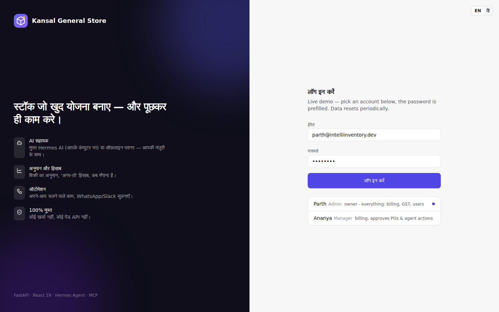
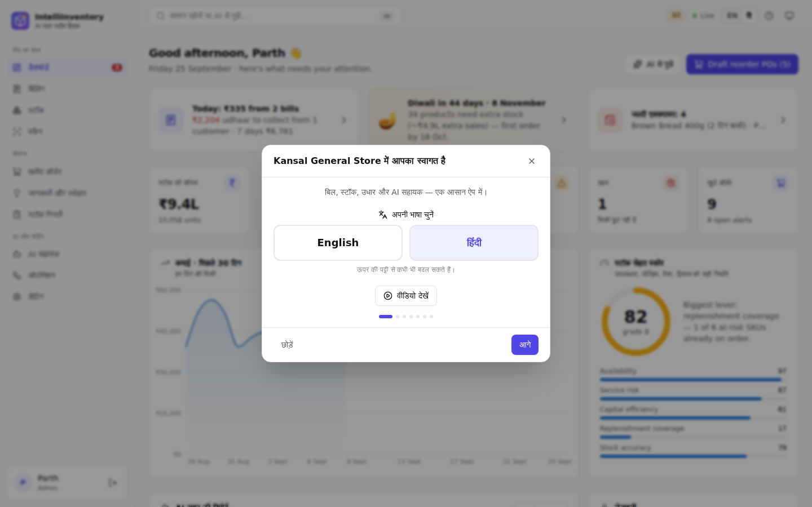
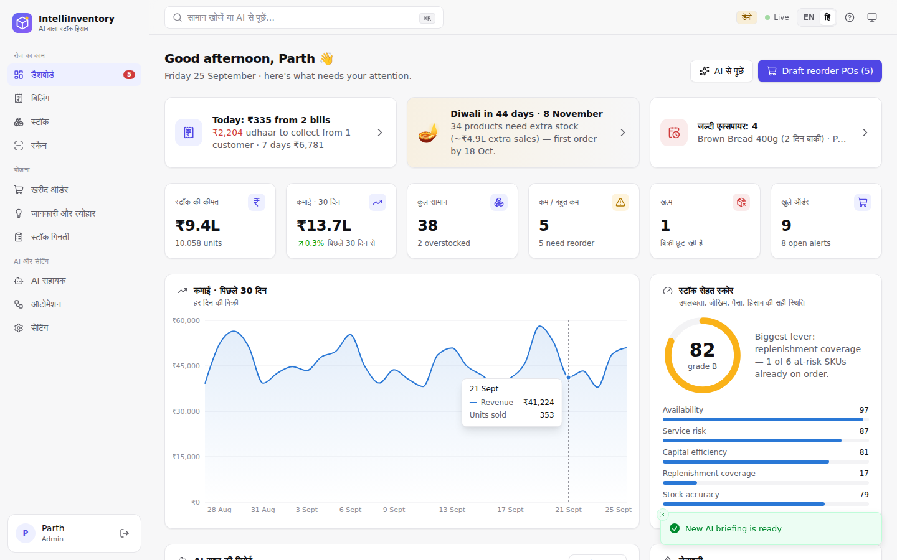
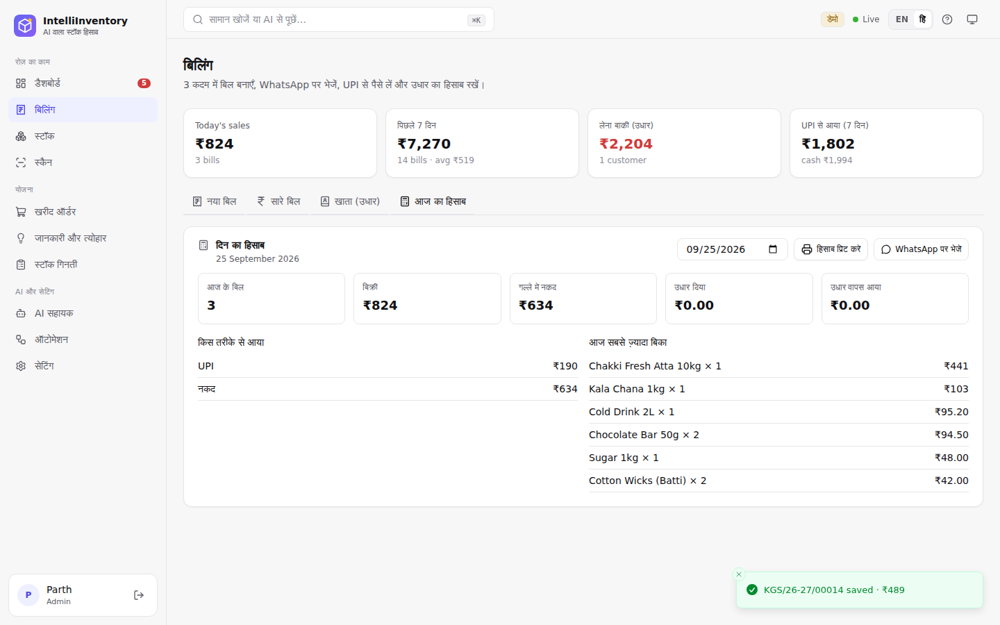
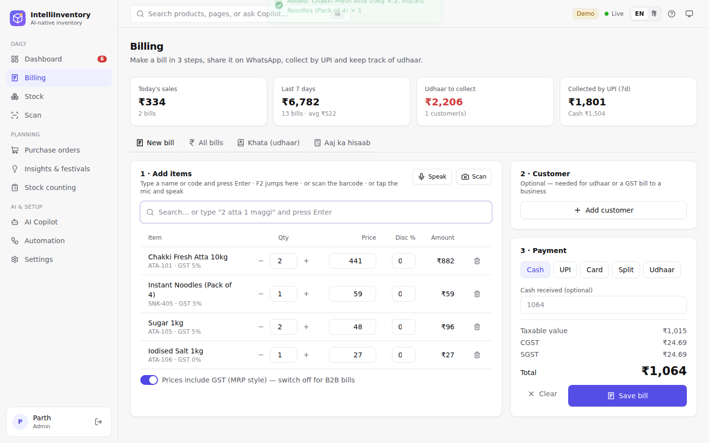
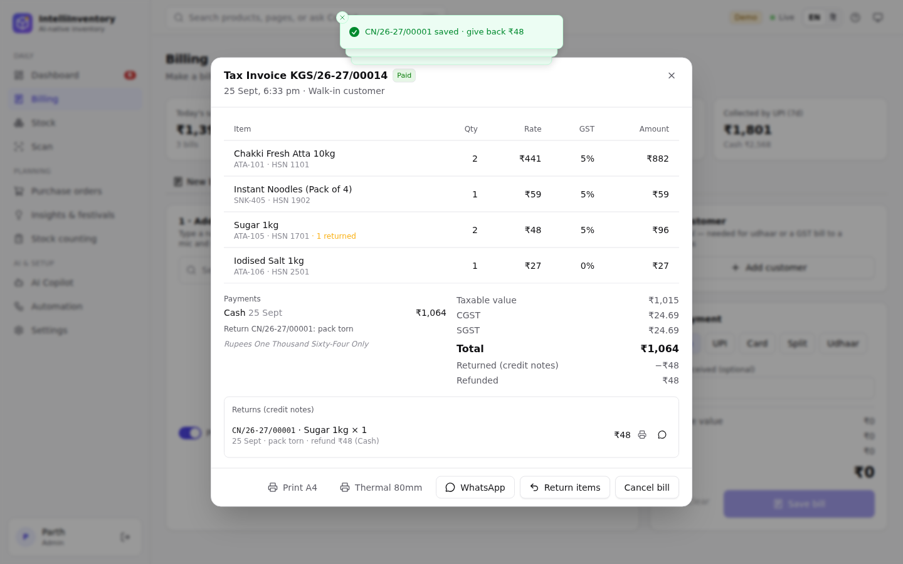
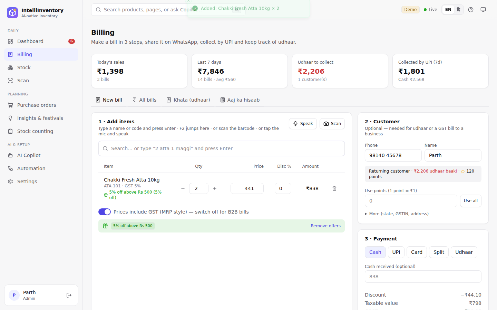
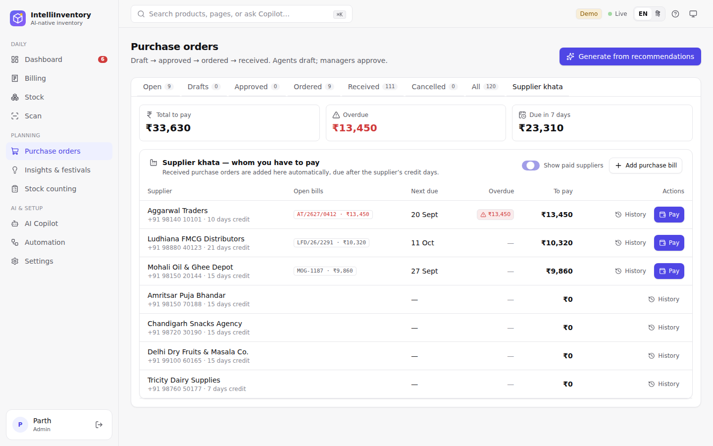

# IntelliInventory — Poora Tutorial (Hinglish)

Yeh guide aapko **zero se** sab kuch sikhayegi: computer pe kaise chalana hai, roz ka kaam (billing, stock, khata),
AI Copilot, GST, festival planning, aur **free mein online kaise daalna hai** (ek demo link + ek asli dukaan ka link).

> Sab kuch **free** hai. Koi paid API nahi. AI (Hermes) aapke apne computer / free server pe chalta hai.
>
> **Hindi mein chalana hai?** App mein upar **EN / हिं** button dabao — poora app Hindi mein. Pehli baar login pe ek chhota
> tutorial khulta hai (❓ button se dobara dekh sakte ho) aur ek **video** bhi hai: [tutorial video](../frontend/public/tutorial.webm)
> (app mein ❓ → वीडियो देखें).
>
> Demo dukaan: **Kansal General Store, Kharar (Punjab)** — kiryana ka saaman. App har shop aur har state ke liye chalta hai;
> festivals aapki dukaan ke state ke hisaab se aate hain.

---

## Index

0. [Hindi, tutorial aur video](#0-hindi-tutorial-aur-video)
1. [Yeh app kya karta hai?](#1-yeh-app-kya-karta-hai)
2. [Computer pe chalana (Windows / Mac / Linux)](#2-computer-pe-chalana)
3. [Pehla login — Demo vs Asli dukaan](#3-pehla-login--demo-vs-asli-dukaan)
4. [Sabse pehle: Shop details bharo](#4-sabse-pehle-shop-details-bharo)
5. [Billing — bill kaise banaye (3 steps)](#5-billing--bill-kaise-banaye-3-steps)
6. [Khata (udhaar) — kisko kitna dena hai](#6-khata-udhaar)
   - [Bolke bill, wapsi (return), offers & points, offline billing](#bolke-bill-mic)
7. [Stock — products, GST, scan](#7-stock--products-gst-scan)
8. [Purchase orders — supplier se maal mangwana + supplier khata](#8-purchase-orders)
9. [Insights & festivals — Diwali ki taiyari](#9-insights--festivals)
10. [GST — optional, AI se bharo, rate badle toh?](#10-gst)
11. [AI Copilot — Hindi/Hinglish mein poocho](#11-ai-copilot)
12. [Hermes AI free mein kaise chalaye](#12-hermes-ai-free-mein)
13. [Users & roles + backup](#13-users--roles)
14. [Automation, hooks, webhooks (advanced)](#14-automation-hooks-webhooks)
15. [Demo link online (free)](#15-demo-link-online-free)
16. [Payment gateway ka sawaal](#16-payment-gateway-ka-sawaal)
17. [Problem aaye toh (Troubleshooting)](#17-troubleshooting)

---

## 0. Hindi, tutorial aur video

| | |
|---|---|
|  |  |
| **Hindi / English** — upar EN / हिं | **Pehle login pe tutorial** — ❓ se dobara |

- Bhasha ek click mein badlo — login page pe bhi. Aapki choice browser yaad rakhta hai.
- **Video** (66 sec, Hindi + English captions): app mein ❓ → **वीडियो देखें**, ya `frontend/public/tutorial.webm`.



---

## 1. Yeh app kya karta hai?

| Kaam | Kahan |
|---|---|
| Bill banana (GST ya bina GST), UPI QR, WhatsApp pe bill bhejna, print | **Billing** |
| Udhaar ka hisaab, WhatsApp reminder | **Billing → Khata** |
| Kitna maal hai, kab khatam hoga, kab mangwana hai | **Stock** |
| Supplier ko order (PO) bhejna, GST + e-way bill | **Purchase orders** |
| Diwali / Holi / Eid ke liye kya stock karna hai | **Insights & festivals** |
| GST kitna banega (output tax vs ITC) | **Insights → GST** |
| "aaj ki sale kitni hui?" jaise sawaal | **AI Copilot** |
| Din ke end ka hisaab (galla, UPI, udhaar) | **Billing → Aaj ka hisaab** |
| Jaldi expire hone wala maal | **Dashboard** / **Stock → Expiring soon** |


---

## 2. Computer pe chalana

### Ek baar install karo (sirf pehli baar)

1. **Git** — https://git-scm.com/downloads
2. **Node.js (LTS)** — https://nodejs.org
3. **uv** (Python ka tool, Python khud install kar leta hai):
   - **Windows (PowerShell):**
     ```powershell
     powershell -ExecutionPolicy ByPass -c "irm https://astral.sh/uv/install.ps1 | iex"
     ```
     Phir **PowerShell / cmd band karke dobara kholo** (warna `'uv' is not recognized` aayega).
   - **Mac / Linux:**
     ```bash
     curl -LsSf https://astral.sh/uv/install.sh | sh
     ```

### Code download karo

```bash
git clone https://github.com/parthkansal823/IntelliInventory.git
cd IntelliInventory
```

### Chalao — sabse aasaan tarika (one-click)

- **Windows:** `scripts\start-windows.bat` pe **double-click** karo.
- **Mac / Linux:** `./scripts/start.sh`

Pehli baar 2–5 minute lagenge (sab install hota hai). Phir browser mein khud khulega: **http://localhost:8000**

### Developer tarika (code badalna ho toh — auto reload)

Do terminal kholo:

```bash
# Terminal 1 — backend (API) :8000
cd backend
uv run uvicorn app.main:app --reload

# Terminal 2 — frontend (UI) :5173
cd frontend
npm install
npm run dev
```

Browser: **http://localhost:5173**. (Mac/Linux pe `make install` aur `make dev` bhi chalega.)

### Docker se (optional)

```bash
docker compose up --build                     # http://localhost:8000
docker compose --profile hermes up --build    # + Hermes AI (Ollama)
docker compose exec ollama ollama pull hermes3:3b   # pehli baar model download
```

---

## 3. Pehla login — Demo vs Asli dukaan

App do tarah chalta hai:

| Mode | Kab | Kya hota hai |
|---|---|---|
| **Demo** (`DEMO_MODE=true`, default) | Dikhane / seekhne ke liye | 37 sample products, 120 din ki sale, bills, udhaar — sab bhara hua. Login page pe demo accounts dikhte hain. |
| **Asli dukaan** (`DEMO_MODE=false`) | Apne business ke liye | Khaali catalogue, sirf ek **admin** account (aapka). Koi sample data nahi. |


**Demo logins** (password `demo1234`):
- **Parth** — `parth@intelliinventory.dev` — Owner / Admin (sab kuch)
- **Ananya** — `ananya@intelliinventory.dev` — Manager (billing, approvals)

**Asli dukaan ke liye** `backend/.env` file banao (`.env.example` copy karke):

```ini
DEMO_MODE=false
ADMIN_EMAIL=aap@aapkidukaan.in
ADMIN_NAME=Aapka Naam
ADMIN_PASSWORD=koi-strong-password
SECRET_KEY=koi-lambi-random-line-yahan-likho
```

Phir app chalao, isi email/password se login karo.

> Demo data dobara chahiye? App band karo, `backend/data/intelliinventory.db` delete karo, phir chalao.
> Password bhool gaye? `cd backend` → `uv run python -m app.cli reset-password aap@aapkidukaan.in naya-password`

---

## 4. Sabse pehle: Shop details bharo

**Settings → Business & GST → Shop details**

- Dukaan ka naam, address, phone
- **GSTIN** (agar hai) — state khud GSTIN se aa jaata hai
- **UPI ID** (jaise `aapkidukaan@okaxis`) — isse har bill pe **exact amount wala UPI QR** banta hai
- **Bill number prefix** — `INV` → bills `INV/26-27/00001` banenge (har financial year April–March nayi series)
- Footer / terms (jaise "Goods once sold will not be taken back")


---

## 5. Billing — bill kaise banaye (3 steps)

Sidebar → **Billing** → **New bill**


**Step 1 · Items daalo**
- Naam ya code likho (jaise `basmati`) → **Enter** dabao → item add.
- **Scan** button → phone/laptop camera se barcode scan.
- Qty `–`/`+`, price aur **Disc %** badal sakte ho. Stock kam hai toh laal mein warning.
- **Prices include GST** (MRP style) ON = counter sale; OFF = B2B bill (price + GST).
- Shortcut: **F2** = search box.

**Step 2 · Customer (optional)**
- Walk-in customer ke liye kuch mat bharo.
- Phone number daalo → purana customer hai toh naam khud aa jaata hai + **"₹X udhaar baaki"** dikhta hai.
- "More" mein: State (dusre state = IGST), **Outside India** (export — zero-rated), GSTIN (business customer).
- Phone number **+91 zaroori nahi** — `98200 12345` likho toh +91 lag jaata hai; bahar ka number `+971 50 123 4567` jaisa likho.

**Step 3 · Payment**
- **Cash** — "Cash received" likho → wapas kitna dena hai (change) dikhega.
- **UPI** — "Show UPI QR" → customer GPay/PhonePe/Paytm se scan kare → UTR (optional) likho.
- **Card**
- **Split** — thoda cash + thoda UPI; bacha hua khata mein.
- **Udhaar** — poora amount customer ke khata mein.

**Save bill** → bill khulta hai:


- **Print A4** (GST tax invoice, HSN summary, amount in words, UPI QR, signature)
- **Thermal 80mm** (chhota printer wala bill)

| A4 tax invoice | Thermal 80 mm |
|---|---|
|  |  |

- **WhatsApp** — customer ko bill ka message (free, `wa.me` link)
- **Receive payment** — baaki paisa baad mein
- **Cancel bill** (manager) — stock wapas aa jaata hai

**All bills** tab: search, filter (udhaar/paid/cancelled), aur **Sales register (CSV for CA)** — GSTR-1 friendly file, CA ya Tally ke liye.

GST ke hisaab se bill khud sahi banta hai:

| Situation | Bill type | Tax |
|---|---|---|
| Customer same state / walk-in | Tax Invoice | CGST + SGST |
| Customer dusre state | Tax Invoice | IGST |
| Customer Outside India (export) | Export Invoice | 0 (LUT note) |
| GST OFF (registered nahi) | Bill of Supply | koi tax nahi |

---

## 6. Khata (udhaar)

**Billing → Khata (udhaar)**


- Kis customer pe kitna baaki, kitne din se (30+ din laal).
- **Remind** → WhatsApp pe Hinglish reminder (UPI ID ke saath) — free.
- **Collect** → paisa aaya toh amount + mode likho → **sabse purana bill pehle** clear hota hai.

### Aaj ka hisaab (din ka end)

**Billing → Aaj ka hisaab**: aaj ke bill, kul bikri, **galle mein kitna cash**, UPI/card, aaj kitna udhaar diya aur kitna
purana udhaar aaya, sabse zyada bikne wala saaman. **Print** (chhota printer) ya **WhatsApp** pe bhejo. Tareekh badal
ke purane din ka hisaab bhi dekh sakte ho. Copilot se bhi: *"aaj ka hisaab batao"*.



Hisaab mein ab **wapsi (returns)**, cash refund aur **supplier ko diya paisa** bhi dikhta hai — galle ka cash inko
ghata ke dikhaya jaata hai.

### Bolke bill (mic)

**Billing → 1 · Add items → 🎤 Speak** dabao aur bolo: *"do kilo aata aur ek maggi"* ya *"cheeni do packet, namak
ek"*. Saaman quantity ke saath bill mein aa jaata hai. Hindi (हिं) chuna ho toh Hindi mein suno, warna English/Hinglish.

- Mic nahi hai? Search box mein **likho** `2 atta 1 maggi` aur **Enter** — same kaam.
- Jo shabd samajh nahi aaya woh "Not found" mein dikhta hai — use haath se add karo.
- Mic Chrome / Edge (Android, Windows) mein chalta hai. Samajhna offline hota hai — koi paid service nahi.



### Wapsi (return) — credit note

Bill kholo (**All bills** → bill) → **Return items** → jo saaman wapas aaya uski quantity (+) → refund **Cash / UPI /
Bank** → **Save return**.

- Stock wapas shelf pe, **credit note** (CN/26-27/00001) banta hai — print ya WhatsApp.
- Customer ka us bill pe udhaar baaki ho toh pehle **udhaar mein se ghat-ta** hai, bacha paisa wapas.
- Poora bill galat ho toh ab bhi **Cancel bill** (manager). ₹2,000 se bada cash refund sirf manager.
- GST report aur sales register (CSV) mein credit note apne aap minus hota hai.
- Saari wapsi ek jagah: **All bills → Returns** (credit note par click = asli bill khulta hai).



### Offers & loyalty points (optional — default band)

**Settings → Business & GST → Offers & loyalty** ON karo (sirf tab chalu hota hai jab aap chaho):

| Offer | Example |
|---|---|
| Poore bill pe % | ₹500 se upar 5% off |
| Buy X get Y | Maggi 2 lo 1 free |
| Item / category pe % | Personal Care pe 10% |

Bill banate waqt offer **apne aap** lagta hai (hara chip dikhta hai) — **Remove offers** se us bill se hata sakte ho.
**Loyalty points**: har ₹100 pe X point; purana customer (phone se pehchana) agli baar **Use points** se payment
kar sakta hai. Bill cancel/return pe points wapas adjust hote hain.



### Internet chala jaye? (offline billing)

Bill save karte waqt internet/server nahi mila toh bill **isi phone/computer mein** save hota hai (`OFF-1`, `OFF-2`…).
Upar **"1 bill(s) to sync"** dikhega. Internet aate hi (ya har 30 second) bill **apne aap** server pe chala jaata hai
aur asli bill number milta hai — do baar sync ho tab bhi bill ek hi baar banta hai. Products aur customers ki list
bhi aakhri baar wali yaad rehti hai, isliye billing screen offline khulti hai.

- Offline bill ki **parchi (receipt)**: save hote hi message mein **Print** dabao, ya upar "bills to sync" list mein 🖨️ —
  "PROVISIONAL RECEIPT · OFF-1" chhapti hai (asli bill number sync ke baad).
- Internet band ho tab bhi **likh ke bill** (`2 atta 1 maggi`) chalta hai — phone khud match kar leta hai.

### Customer history

**Khata** mein customer ke naam pe click (ya naya bill banate waqt phone daalo → **History**) → kitne bill, kul kitna kharida, kya sabse zyada leta hai, points, udhaar.
Copilot se: *"Parth ki history dikhao"*.

---

## 7. Stock — products, GST, scan

**Stock** page: har product ka stock, status (out / critical / low / healthy / overstock), kitne din chalega.


- Product pe click → forecast chart, warehouse-wise stock, movements, GST/HSN, **barcode, unit, expiry**, margin.
- **Barcode scanner:**
  - **USB scanner** (₹1,000–1,500 wala) — kuch setup nahi: Billing ke search box mein scan karo, saaman bill mein aa jaata hai.
  - **Phone / laptop camera** — Billing mein **Scan** button, ya product form mein barcode ke paas 📷 button.
  - Naya saaman add karte waqt packet ka barcode scan karo — agli baar bill mein scan karte hi mil jaayega.
- **Expiry:** har product ki expiry date daalo. 15 din ke andar expire hone wala maal **Dashboard** aur **Stock → Expiring soon**
  mein laal dikhta hai — pehle becho ya supplier ko lautao. Copilot: *"kaunsa maal expire hone wala hai?"*
- **Add product** — SKU, naam, cost, selling price. **GST optional**: khaali chhodo, AI naam se HSN + GST bhar dega; ya **Suggest with AI** dabao.
- **Fill GST with AI** — jin products ka GST khaali hai sab ek click mein. AI wale rates pe "AI (check)" likha aata hai — ek baar CA se confirm kar lo.
- **Import CSV** (preview ke baad import), **Export**.
- **Scan** page (sidebar): phone se barcode scan karke receive / sell / return / adjust. Phone pe "Install app" karke app jaisa use karo.
- **Stock counting**: physical count → difference → manager approve → stock theek.

---

## 8. Purchase orders

**Purchase orders** → **Generate from recommendations** (jo kam hai uske PO, supplier-wise).


Flow: **Draft → Approved → Ordered → Received** (receive karte hi stock badhta hai).

- GST breakup: same state = CGST + SGST, dusra state = IGST.
- ₹50,000 se zyada ka maal → **e-way bill** warning.
- **Send on WhatsApp** → supplier ko PO ka message.
- Supplier ka UPI ID ho toh **UPI QR** se payment.

### Supplier khata (supplier ka udhaar)

**Purchase orders → Supplier khata**: kis supplier ko **kitna dena hai**, kab tak, kya **overdue** (laal) hai.

- PO **Received** hote hi uska bill apne aap yahan judta hai — due date = aaj + supplier ke **credit days**
  (Settings → Catalog → supplier, default 15 din).
- Bina PO ka maal aaya? **Add purchase bill** se supplier ka bill number + amount daalo.
- **Pay** → Cash / UPI (supplier ke UPI ka QR) / Bank / Cheque — paisa **sabse purane bill** mein pehle lagta hai.
- **History** → us supplier ke saare bill (chukta + baaki) aur diye gaye paise. **Show paid suppliers** se chukta
  supplier bhi dikhte hain.
- Credit days badalne ho: **Settings → Catalog → Suppliers → ✏️** (credit days, UPI, GSTIN, phone sab badal sakte ho).
- Poora paisa dene pe us supplier ka **alert apne aap band** ho jaata hai.
- Dashboard pe **"Dena baaki"** card, aur 2 din pehle **alert**. Copilot se: *"supplier ko kitna dena hai?"*



---

## 9. Insights & festivals

**Insights & festivals** page ke tabs:

| Tab | Kya milta hai |
|---|---|
| **Reorder plan** | Kya mangwana hai, kitna, kyun — ek click mein POs |
| **🪔 Festival planner** | **Aapke state ke festivals** — sab jagah wale (Diwali, Holi, Eid, Rakhi, Navratri…) + regional (Punjab: Lohri, Baisakhi, Gurpurab · Bengal/Assam: Durga Puja, Bihu · Bihar/UP: Chhath · Tamil Nadu: Pongal · Kerala: Onam · Maharashtra/Karnataka/Telangana: Ganesh Chaturthi, Gudi Padwa/Ugadi…). Kitna extra maal, **kab tak order karna hai** → **Draft festival POs** |
| **GST** | Output tax vs input tax credit, slab-wise |
| **Forecast & what-if** | "Demand 30% badhi toh?" — simulation |
| **Smart markdowns** | Zyada pada maal — kitna discount do |
| **ABC / Anomalies / Suppliers / Margins** | Analysis |


Dashboard pe bhi agla festival aur aaj ki billing dikhti hai. **State badalna:** Settings → Dukaan ki jaankari → State.

---

## 10. GST

- **Optional hai.** Registered nahi ho? **Settings → Business & GST → "I am GST-registered" OFF**. Tab bills "Bill of Supply" banenge, POs bina tax.
- **GST 2.0** (22 Sep 2025 se) slabs: **0 / 5 / 18 / 40%** (+ gold 3%). 12% aur 28% hat gaye.
- **Rate badle toh?** Settings mein **GST slabs** edit karo (jaise `0, 5, 12, 18, 28`) → **Save**. AI suggestions naye slabs pe snap honge. **Re-check AI-filled rates** se AI wale rates dobara check honge. **Aapke haath se daale rates kabhi overwrite nahi hote.**
- GSTIN checksum validate hota hai (galat GSTIN reject).


> GST rates illustrative hain — file karne se pehle apne CA se confirm karein.

---

## 11. AI Copilot

Sidebar → **AI Copilot**. Hindi / Hinglish / English — sab chalta hai:

- `aaj ki sale kitni hui?`
- `aaj ka hisaab batao`
- `kaunsa maal expire hone wala hai?`
- `kiska udhaar baaki hai?`
- `Diwali ke liye kya stock karna hai?`
- `kaunsa stock kam hai aur kya order karna hai?`
- `is mahine GST kitna banega?`
- `show invoice INV/26-27/00003`
- `What if demand for ATA-105 rises 30%?`


- **🎤 Mic** se bolo. **EN / हिं** button se Hindi voice (bolna + sunna).
- Copilot ke saath 4 specialists: Analyst, Forecaster, Procurement, Auditor.
- **Safety:** stock badalna, transfer, PO status — AI khud nahi karta, **approval** maangta hai (Approvals panel → Approve & run).
- **Ctrl+K** (Mac: ⌘K) — kahin se bhi search / quick sawaal.

---

## 12. Hermes AI free mein

Bina kisi setup ke bhi Copilot chalta hai (**offline planner** — fast, free, Hinglish samajhta hai).
Asli AI (Hermes, Nous Research) chahiye toh — **free, aapke computer pe:**

1. **Ollama** install karo — https://ollama.com/download
2. Model download:
   ```bash
   ollama pull hermes3:3b     # ~2 GB — 8 GB RAM laptop pe chalega
   # ya
   ollama pull hermes3        # ~4.7 GB — 16 GB RAM, zyada smart
   ```
3. `backend/.env` mein: `HERMES_MODEL=hermes3:3b` (jo model liya)
4. App restart. **Settings → AI providers** mein "Hermes" = ready dikhega. Auto mode khud Hermes use karega.

---

## 13. Users & roles

**Settings → Users** (admin): naye log add karo.

| Role | Kya kar sakta hai |
|---|---|
| viewer | sirf dekhna |
| staff | billing, scan, counting, PO draft |
| manager | + approvals, bill cancel, GST settings, CSV export |
| admin | sab kuch + users |

---

### Backup (zaroori!)

**Settings → Preferences → Download backup** (sirf admin) — poora data ek file (`intelliinventory-2026-09-25.db`)
mein. Har hafte pen drive / Google Drive pe rakho. Wapas lana ho: app band karo → file ko
`backend/data/intelliinventory.db` naam se rakho → app chalao.

---

## 14. Automation, hooks, webhooks

**Automation** page (advanced — zaroorat ho tabhi):
- **Autopilot**: stock kam hote hi AI khud draft PO banata hai (approval ke liye).
- **Hooks**: har AI action se pehle/baad safety checks — on/off kar sakte ho.
- **Webhooks**: events (bill bana, stock kam hua…) Slack/Discord/apne system pe bhejo.
- **Scheduled jobs**: roz subah AI briefing, anomaly scan.
- **Hermes Agent / MCP**: Settings → Hermes & MCP — Hermes Agent (Telegram/WhatsApp bot) ko poora inventory toolset de sakte ho. Details: `integrations/hermes/`.

---

## 15. Demo link online (free)

Demo = sample dukaan (Parth / Ananya logins) jo aap kisi ko bhi link bhej ke dikha sakte ho.
Hum **Koyeb** use karte hain — free (1 app), GitHub se seedha deploy, aur `main` pe push karte hi khud update.

> Free server mein RAM kam (512 MB) hai, isliye demo mein AI Copilot **offline planner** se chalta hai (Hinglish samajhta hai).
> Hermes AI ke liye app apne computer pe chalao (section 12).

### Steps (10 minute)

1. https://www.koyeb.com → **Sign up** → **Continue with GitHub**.
2. Dashboard → **Create Service** (ya **Create Web Service**) → **GitHub** → GitHub access do → repo **`IntelliInventory`** chuno, branch **`main`**.
3. **Builder**: **Dockerfile** chuno (Dockerfile path: `Dockerfile` — root mein hai).
4. **Instance**: **Free** · Region: **Frankfurt** (India ke sabse paas wala free region).
5. **Environment variables** mein yeh 3 add karo:

   | Name | Value |
   |---|---|
   | `DEMO_MODE` | `true` |
   | `AI_PROVIDER` | `offline` |
   | `OLLAMA_AUTODETECT` | `false` |

6. **Exposed ports**: `8000` (HTTP), path `/`. **Health check**: HTTP, path `/api/health`.
7. **Service name**: `intelliinventory-demo` → **Deploy**.
8. 5–10 minute mein build → link milega jaise `https://intelliinventory-demo-aapka-naam.koyeb.app`.
   Kholo → **Parth** ya **Ananya** → password `demo1234`. 🎉

### Update kaise hota hai (CI/CD)

```
Aap main pe push karo → GitHub CI (tests, lint, build, Docker smoke test)
                      → Koyeb khud naya version build + deploy karta hai
```

GitHub pe CI laal ❌ ho toh pehle use theek karo — Actions tab mein error dikhta hai.

### Dhyan rakhein
- 1 ghante koi na khole toh demo **so jaata hai**; agli baar kholne pe ~1 minute lagta hai.
- Demo ka data restart/deploy pe **reset** hota hai — sirf dikhane ke liye hai, asli billing ke liye nahi.
- Koyeb sign-up pe card maange toh "Hobby / Free" plan hi chunna — free instance pe charge nahi hota.
- Error? Koyeb → service → **Logs** / **Build logs** dekho.

---

## 16. Payment gateway ka sawaal

**Apna payment gateway banana practical nahi hai:** RBI ka Payment Aggregator authorisation chahiye — apply karte waqt
₹15 crore net worth aur teesre saal tak ₹25 crore, sirf company ke roop mein, plus card data ke liye PCI-DSS.

**Isliye app mein free tarika:** **UPI QR** — bill ka exact amount QR mein, paisa **seedha aapke bank account** mein,
koi gateway fee nahi. UTR number bill pe save hota hai. ₹2,000 tak ke UPI payments pe koi MDR nahi, aur chhote merchants
(apne UPI QR pe ₹1 lakh/mahina tak) ke liye bhi zero MDR rehta hai. 15 Oct 2026 se kuch bade merchants ko ₹2,000 se upar
ke UPI payments pe 0.4% MDR lag sakta hai (₹75,000+ pe ₹300 cap) — apne bank se confirm kar lein.

Baad mein automatic "payment aaya" confirmation chahiye ho toh Razorpay / Cashfree jaisa gateway jod sakte hain —
lekin unki fees lagti hai, isliye default mein nahi rakha.

---

## 17. Troubleshooting

| Problem | Hal |
|---|---|
| `'uv' is not recognized` | uv install ke baad **terminal band karke dobara kholo**. Phir bhi nahi? `%USERPROFILE%\.local\bin` ko PATH mein daalo. |
| PowerShell: "running scripts is disabled" | `powershell -ExecutionPolicy ByPass -c "irm https://astral.sh/uv/install.ps1 \| iex"` (upar wala command waise hi chalao) |
| Port 8000 busy | `uv run uvicorn app.main:app --port 8010` aur http://localhost:8010 kholo |
| Demo data reset | App band → `backend/data/intelliinventory.db*` delete → start |
| Admin password bhool gaye | `cd backend` → `uv run python -m app.cli reset-password email naya-password` |
| Copilot "offline" dikha raha | Ollama chal raha hai? `ollama list` mein hermes model hai? `.env` mein `HERMES_MODEL` sahi? |
| Hermes slow | `hermes3:3b` use karo, ya Copilot header se "Offline" choose karo |
| Bill pe UPI QR nahi | Settings → Shop details → UPI ID bharo |
| GST nahi dikh raha | Settings → Business & GST → "I am GST-registered" ON |

---

Aur kuch chahiye? GitHub pe issue kholo ya Copilot se poocho 🙂
